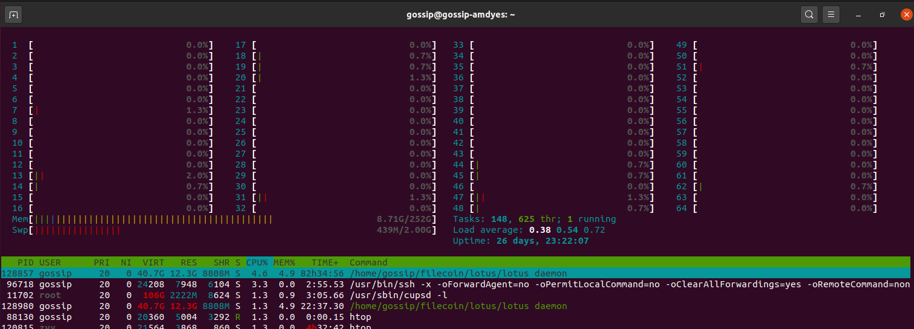

# 密封32GB扇区的资源消耗情况


## 1. 磁盘最大消耗

磁盘最大消耗情况，其实不止 `516.64GiB`，因为在每次生成 `tree-r-last` 的时候，都会临时保存中间的 `4.6GB` 数据磁盘中，例如： `[4.6G]  sc-02-data-tree-r-last-6.dat`，因此一次密封过程中的最大磁盘消耗，应该是 `516.64GiB - 9.1MB + 4.6GB`，约等于  `522GiB`。
具体情况如下所示：

```sh
[2020_12_23_04_01]: current size: 554741069840 (516.64GiB)
/home/gossip/disk_nvme1/lotus-bench
└── [4.0K]  bench159597807
    ├── [4.0K]  cache
    │   └── [4.0K]  s-t01000-1
    │       ├── [  64]  p_aux
    │       ├── [ 32G]  sc-02-data-layer-10.dat
    │       ├── [ 32G]  sc-02-data-layer-11.dat
    │       ├── [ 32G]  sc-02-data-layer-1.dat
    │       ├── [ 32G]  sc-02-data-layer-2.dat
    │       ├── [ 32G]  sc-02-data-layer-3.dat
    │       ├── [ 32G]  sc-02-data-layer-4.dat
    │       ├── [ 32G]  sc-02-data-layer-5.dat
    │       ├── [ 32G]  sc-02-data-layer-6.dat
    │       ├── [ 32G]  sc-02-data-layer-7.dat
    │       ├── [ 32G]  sc-02-data-layer-8.dat
    │       ├── [ 32G]  sc-02-data-layer-9.dat
    │       ├── [4.6G]  sc-02-data-tree-c-0.dat
    │       ├── [4.6G]  sc-02-data-tree-c-1.dat
    │       ├── [4.6G]  sc-02-data-tree-c-2.dat
    │       ├── [4.6G]  sc-02-data-tree-c-3.dat
    │       ├── [4.6G]  sc-02-data-tree-c-4.dat
    │       ├── [4.6G]  sc-02-data-tree-c-5.dat
    │       ├── [4.6G]  sc-02-data-tree-c-6.dat
    │       ├── [4.6G]  sc-02-data-tree-c-7.dat
    │       ├── [ 64G]  sc-02-data-tree-d.dat
    │       ├── [9.1M]  sc-02-data-tree-r-last-0.dat
    │       ├── [9.1M]  sc-02-data-tree-r-last-1.dat
    │       ├── [9.1M]  sc-02-data-tree-r-last-2.dat
    │       ├── [9.1M]  sc-02-data-tree-r-last-3.dat
    │       ├── [9.1M]  sc-02-data-tree-r-last-4.dat
    │       ├── [9.1M]  sc-02-data-tree-r-last-5.dat
    │       ├── [9.1M]  sc-02-data-tree-r-last-6.dat
    │       ├── [9.1M]  sc-02-data-tree-r-last-7.dat
    │       └── [1.5K]  t_aux
    ├── [4.0K]  sealed
    │   └── [ 32G]  s-t01000-1
    └── [4.0K]  unsealed
        └── [ 32G]  s-t01000-1

5 directories, 32 files
```

## 2. 内存最大消耗

每过 `5` 秒统计了一次内存消耗情况，发现 `P1` 最大内存消耗大约是 `73GB`，`C2` 最大内存消耗大约是 `173GB`，如下所示：

```sh

# P1
[2020_12_23_03_18_01:]
              total        used        free      shared  buff/cache   available
Mem:          251Gi        73Gi       1.6Gi       4.0Mi       176Gi       175Gi
Swap:         2.0Gi       1.2Gi       823Mi

# C2
[2020_12_23_04_11_01:]
              total        used        free      shared  buff/cache   available
Mem:          251Gi       173Gi       1.9Gi        20Mi        76Gi        76Gi
Swap:         2.0Gi       1.2Gi       795Mi

```

注： 统计数据可能不是非常准确。


## 3. 常用的两个查看系统资源的工具


### 3.1 htop 查看 CPU 和内存等信息

`htop` 比系统自带的 `top` 界面更加友好，在 `Ubuntu` 上安装只需要执行：

```sh
sudo apt install htop
```

效果如下：



### 3.2 nvtop 查看显卡信息

`nvtop` 比 `nvidia-msi` 好看多了，但是安装稍微麻烦一些：
在 `Ubuntu 19.04` 之后可以直接使用 `sudo apt install nvtop` 安装，否则，你需要执行以下命令安装：

```sh
sudo apt install cmake libncurses5-dev libncursesw5-dev git
git clone https://github.com/Syllo/nvtop.git
mkdir -p nvtop/build && cd nvtop/build
cmake ..
cmake .. -DNVML_RETRIEVE_HEADER_ONLINE=True  # 如果上一个命令出错就用这个
sudo make install
```

效果如下：


## 4. 其它

本文来自于微信群 `Filecoin技术交流-1/2/3/4群` 群主（`TEARS`）出品，详细信息请查看 [【Filecoin 资源分享目录】](https://github.com/CoinSummer/filecoin)。

如有任何问题，请在微信群 `Filecoin技术交流-1/2/3/4群` 中讨论。

